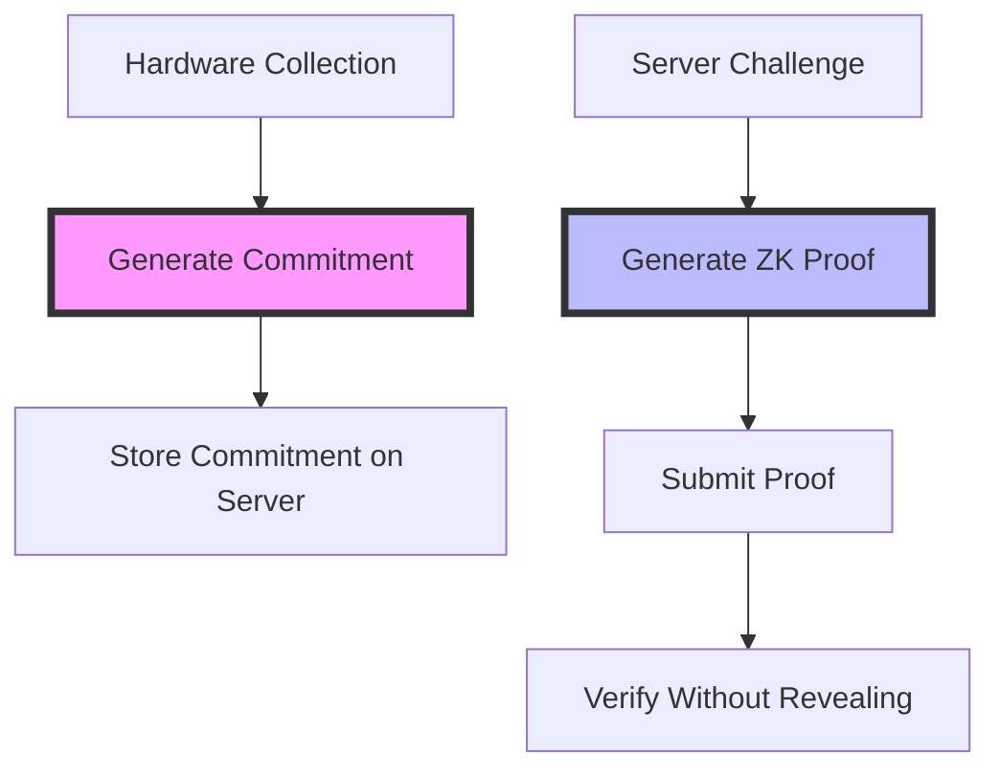

# 🚀 AeroNyx Privacy Network - Zero-Knowledge Proof Update


## 🎉 Major Update: Zero-Knowledge Hardware Attestation

We're excited to announce a groundbreaking update to AeroNyx Privacy Network! This release introduces **Zero-Knowledge Proof (ZKP) based hardware attestation**, revolutionizing how nodes prove their hardware authenticity while maintaining complete privacy.

### 🔐 What's New?

#### **Zero-Knowledge Hardware Attestation**
- Nodes can now prove hardware ownership without revealing hardware details
- Powered by **Halo2**, the cutting-edge ZKP system from Zcash
- No trusted setup required - truly decentralized from day one

#### **Enhanced Privacy**
- Hardware fingerprints never leave your node
- Only cryptographic commitments are shared publicly
- Server verifies hardware authenticity without learning specifics

#### **Improved Security**
- Cryptographically prevents hardware spoofing
- Eliminates multi-registration attacks
- Tamper-proof hardware verification

## 🏗️ Architecture Overview



### Registration Phase
1. **Hardware Fingerprint**: Node collects hardware information locally
2. **Commitment Generation**: `commitment = HASH(hardware_info)` 
3. **Public Storage**: Only the commitment is sent to server
4. **Private Storage**: Actual hardware details remain on node

### Attestation Phase
1. **Challenge**: Server requests hardware proof with random nonce
2. **Proof Generation**: Node creates ZKP proving `knows hardware where HASH(hardware) == commitment`
3. **Verification**: Server verifies proof in milliseconds
4. **Result**: Hardware verified without privacy compromise

## 💻 Technical Implementation

### New Modules
```rust
src/
├── zkp/
│   ├── mod.rs          # ZKP module interface
│   ├── circuit.rs      # Halo2 arithmetic circuit
│   ├── prover.rs       # Proof generation engine
│   └── verifier.rs     # Fast proof verification
```

### Key Features
- **Async Proof Generation**: Non-blocking proof creation
- **Poseidon Hash**: Circuit-friendly hash function
- **Deterministic Serialization**: Consistent hardware representation
- **Proof Expiration**: Time-bound attestations for freshness

## 🚀 Performance Metrics

| Operation | Time | Description |
|-----------|------|-------------|
| Commitment Generation | ~1ms | One-time during registration |
| Proof Generation | 100-500ms | CPU-intensive, async execution |
| Proof Verification | 1-10ms | Lightning fast verification |
| Proof Size | ~1-2KB | Compact network transmission |

## 🔧 Usage Example

### For Node Operators

```bash
# Initial registration with ZKP
aeronyx-private-ed25519 setup --registration-code YOUR_CODE

# Run with ZKP-enabled attestation
aeronyx-private-ed25519 --mode depin-only --enable-zkp
```

### For Developers

```rust
// Generate hardware commitment
let commitment = hardware_info.generate_zkp_commitment();

// Create zero-knowledge proof
let proof = generate_hardware_proof(&hardware_info, &commitment, &params).await?;

// Verify proof (server-side)
let is_valid = verify_hardware_proof(&proof, &commitment, &params)?;
```

## 🛡️ Security Benefits

### Before (Traditional Approach)
- ❌ Hardware details sent to server
- ❌ Server must be trusted with sensitive data
- ❌ Vulnerable to man-in-the-middle attacks
- ❌ Hardware spoofing possible

### After (ZKP Approach)
- ✅ Hardware details never leave node
- ✅ Trustless verification
- ✅ Cryptographically secure
- ✅ Privacy-preserving by design

## 🌟 Why This Matters

### For Privacy Advocates
Your hardware fingerprint is as sensitive as your personal data. With ZKP, it never leaves your control.

### For Network Security
Cryptographic proofs eliminate hardware spoofing, ensuring only genuine nodes participate in the network.

### For Decentralization
No trusted authority needed - mathematics provides the trust.

## 📊 Comparison with Other Solutions

| Feature | AeroNyx (ZKP) | Traditional VPN | Other DePIN |
|---------|---------------|-----------------|-------------|
| Hardware Privacy | ✅ Complete | ❌ Exposed | ❌ Exposed |
| Trustless Verification | ✅ Yes | ❌ No | ❌ No |
| Decentralized | ✅ Yes | ❌ No | ⚠️ Partial |
| Setup Ceremony | ✅ Not Required | N/A | ⚠️ Required |
| Verification Speed | ✅ 1-10ms | N/A | ⚠️ 100ms+ |

## 🔮 Future Enhancements

- **Recursive Proofs**: Aggregate multiple attestations into one
- **Batch Verification**: Verify hundreds of proofs simultaneously  
- **Hardware Classes**: Prove membership without exact match
- **Delegated Proving**: Lightweight nodes can outsource proof generation

## 🧪 Try It Out

### Run the Demo
```bash
cargo run --example zkp_demo
```

### Run Tests
```bash
cargo test -p aeronyx-private-ed25519 zkp::
```

## 📚 Learn More

- [ZKP Module Documentation](src/zkp/README.md)
- [Halo2 Book](https://zcash.github.io/halo2/)
- [Zero-Knowledge Proofs Explained](https://zkp.science/)

## 🤝 Contributing

We welcome contributions to enhance the ZKP implementation:
- Circuit optimizations
- Additional hardware attributes
- Performance improvements
- Security audits

## 📄 License

This update maintains our commitment to open source under the MIT license.

---

<div align="center">

**AeroNyx Privacy Network** - *Where Privacy Meets Performance*

[Website](https://aeronyx.network) | [Documentation](https://docs.aeronyx.network) | [Discord](https://discord.gg/aeronyx)

</div>
